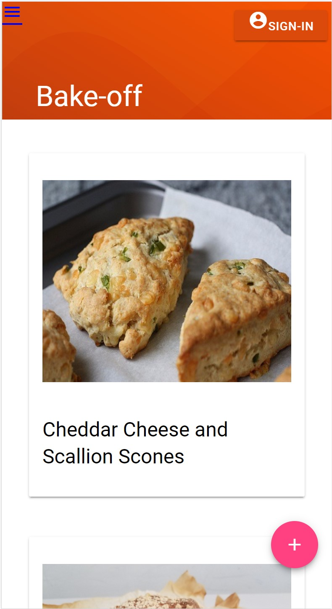
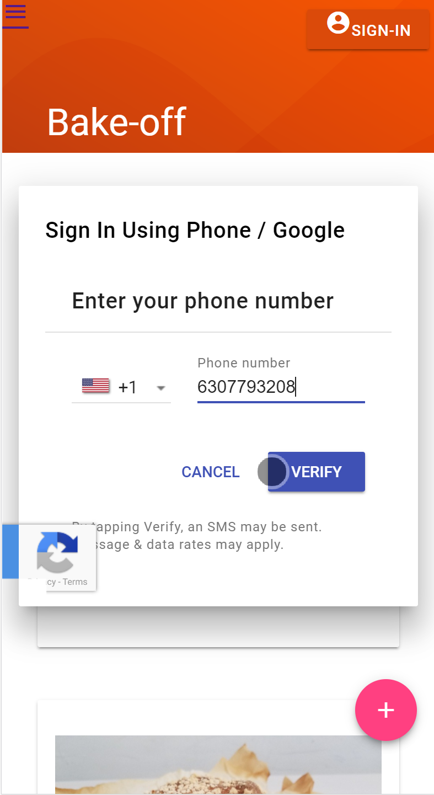
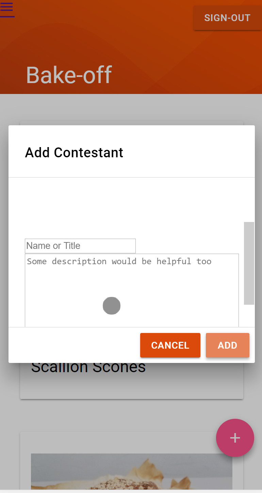
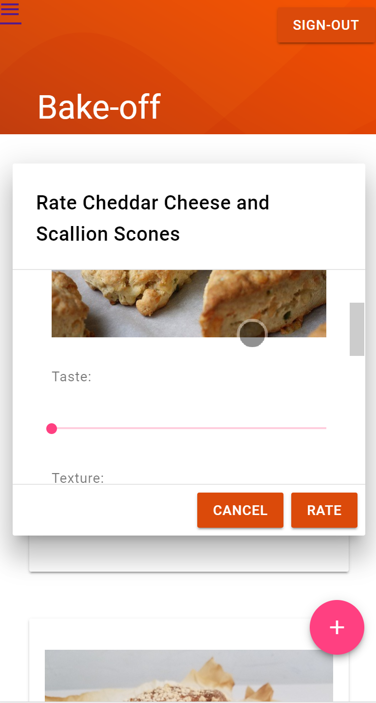
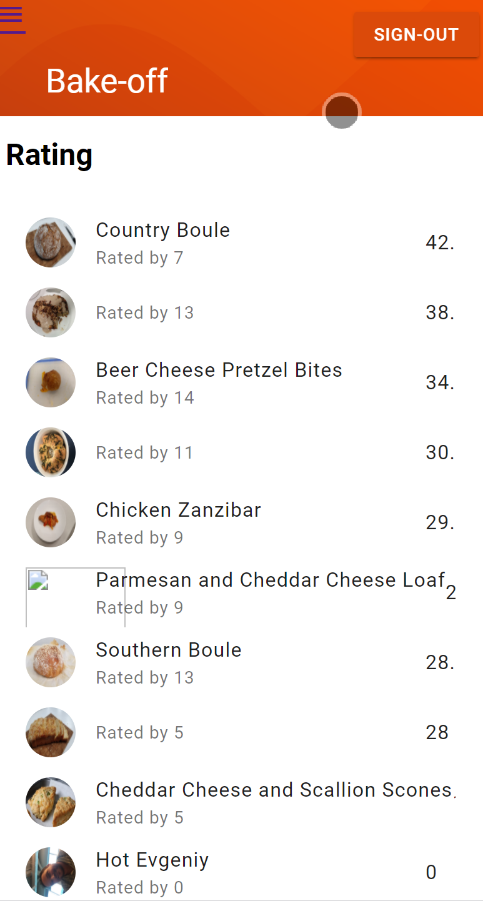

# About #

This is a quick and dirty application to set up contests, such as bake off or cook off, etc.

It is intended to be used from the mobile phone, however there's
nothing that prevents one from using a regular browser.

## Features ##

  * Authenticating users via a mobile phone 
  * Adding contest entries using mobile phone camera 
  * Rating entries on multiple parameters and real-time updated ranking table.
  
# Get Started #

You should get source code and `firebase` tool (it is an NPM package, so you could use `npm`, `yarn` or anything else, you can refer to the [Firebased Documentation](https://firebase.google.com/docs/web/setup)

Edit `.firebaserc` file as necessary to add your projectname and then you should run 

    firebase deploy
    
After that it is available at the [https://projectname.firebaseapp.com](https://projectname.firebase.com)

# Screenshots #

